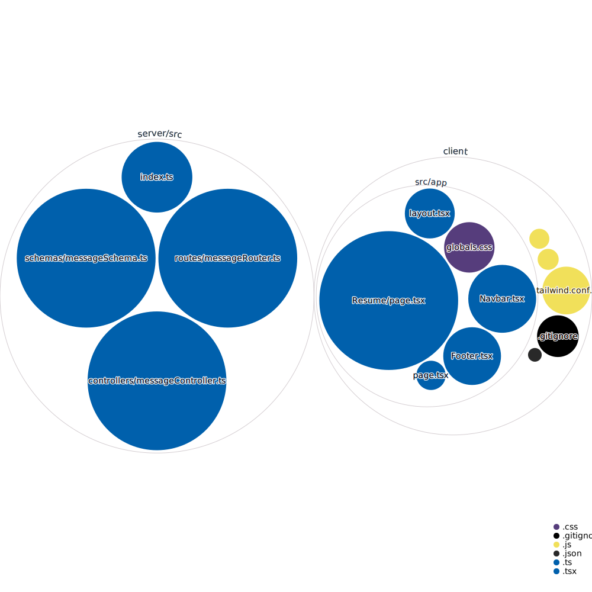

# Project CV

This repository contains a full-stack web application built with Next.js, Express.js, and MongoDB using TypeScript.

## Code overview



## Getting Started

To get started, follow these steps:

1. Clone the repository to your local machine: git clone https://github.com/LukeyBit/Project-CV.git

2. Install dependencies for both the client and server:

* For the client: `cd client && npm install`
* For the server: `cd server && npm install`

3. Set the environment variables:

* In the server directory, copy the contents from the .env.example file into a new file called .env and set the following values:

* PORT: The port the server will run on
* MONGO_URL: The url of the mongo database
* SMTP_HOST: The IP address of the SMTP server
* SMTP_PORT: The port of the SMTP server
* OUT_EMAIL: The email address to send emails from
* IN_EMAIL: The email address to send emails to
* PASSWORD: The password of the email address to send emails from

4. Create a MongoDB database by running the following command in the server directory 
```bash
mongod --dbpath ./data/db
```
This requires [MongoDB Community Server](https://www.mongodb.com/try/download/community) to be installed

5. Start the development server:

* For the client: cd client && npm run dev
* For the server: cd server && npm run dev

6. Open http://localhost:3000 in your browser to see the app.

## Contributing

We welcome contributions from everyone! Before getting started, please read our [Code of Conduct](./CODE_OF_CONDUCT.md) and [Contribution](.github/CONTRIBUTING.md) guidelines.

## License
This project is licensed under the [MIT License](./LICENSE)
