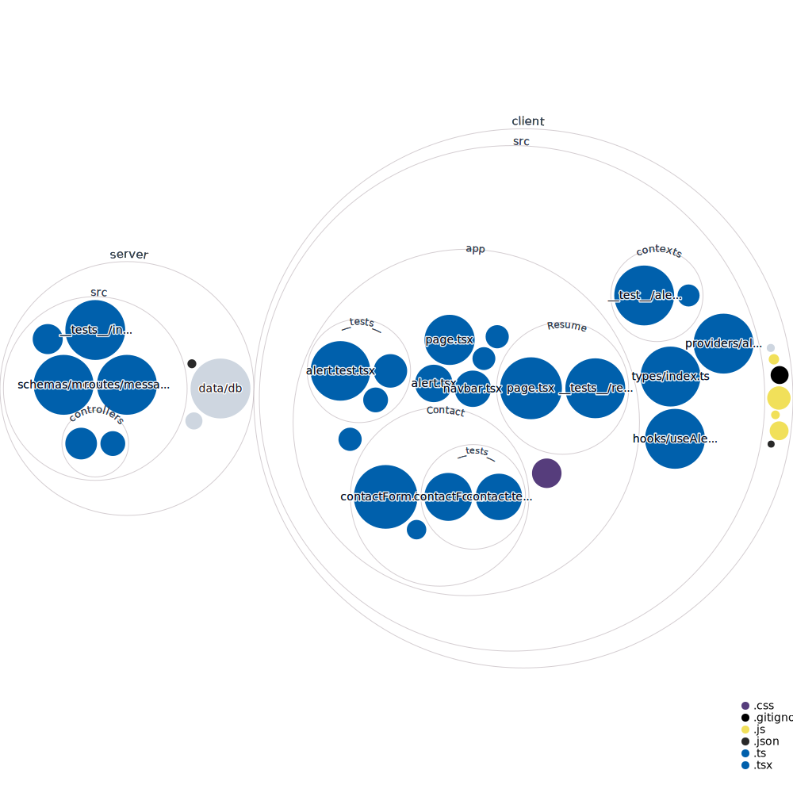

# Project CV

This repository contains a full-stack web application built with Next.js, Express.js, and MongoDB using TypeScript.

## Front-end

This repository contains a Next.js 13 app, which is a powerful React framework for building modern web applications. It combines the simplicity of React with server-side rendering, automatic code splitting, and optimized performance. The Next.js app is located in the client directory. As the app is built using Next.js 13 and is meant to be a example for other developers, the routing is done using the, now recommended, app router. Unit tests are implemented using Jest.

### Pages

- **Home**: The home page serves as the landing page for the website, providing an introduction and overview of your personal brand or the purpose of the website.

- **Resume**: The resume page showcases your professional experience, skills, education, and any other relevant information to highlight your qualifications.

- **Portfolio**: The portfolio page displays a collection of your work, such as projects, case studies, or creative endeavors. It provides visitors with an opportunity to explore and learn more about your previous achievements.

- **Contact**: The contact page allows visitors to reach out to you. It typically includes a contact form where users can submit inquiries, messages, or requests. The submitted contact form messages are stored in a MongoDB database by the back-end server and can be sent to an email address through the specified SMTP server in the .env file in the server.

Feel free to customize and expand these pages to suit your specific needs. Each page can be further enhanced with additional components, styling, and functionality to create a personalized and engaging user experience.

## Design

The design for this project was created using Figma. You can find the complete set of page designs in our Figma project:

[](https://www.figma.com/file/onmg9Kh2y0rD6DNVDvLk0V/Project-CV?type=design&node-id=2%3A125&t=jbjvLg5TtYPx9qu8-1)

Feel free to explore the designs, inspect individual components, and get a visual representation of how the project looks and feels.

If you have any suggestions or feedback regarding the designs, please don't hesitate to let us know!

## Back-end

The backend server of this project is built with Node.js and Express.js, providing the necessary APIs and functionality to handle form submissions from the contact page.

### Functionality

- **Contact Form Submission**: When a user submits the contact form, the backend server processes the form data and uses Nodemailer to send the submission to the email specified by the `IN_EMAIL` environment variable in the `.env` file. This ensures that you receive the messages directly in your email inbox.

- **Submission Storage**: In addition to sending the submissions via email, the backend server also stores the form submissions in a MongoDB database. The database is located in the `/data/db/` directory, and each submission is stored as a document in the database collection.

- **Rate Limiting**: To prevent abuse or spamming, the backend server utilizes `express-rate-limiter` to implement rate limiting functionality. This limits the number of form submissions that can be made from a single IP address within a specified time frame, helping to protect the server and ensure fair usage.

## Code overview



## Getting Started

To get started, follow these steps:

1. Clone the repository to your local machine: `git clone https://github.com/LukeyBit/Project-CV.git`

2. Install dependencies for both the client and server:

* For the client: `cd client && npm install`
* For the server: `cd server && npm install`

3. Set the environment variables:

* In the server directory, copy the contents from the .env.example file into a new file called .env and set the following values:

- PORT: The port the server will run on
- MONGO_URL: The url of the mongo database
- SMTP_HOST: The IP address of the SMTP server
- SMTP_PORT: The port of the SMTP server
- OUT_EMAIL: The email address to send emails from
- IN_EMAIL: The email address to send emails to
- PASSWORD: The password of the email address to send emails from

4. Create a MongoDB database by running the following command in the server directory 
```bash
mongod --dbpath ./data/db
```
This requires [MongoDB Community Server](https://www.mongodb.com/try/download/community) to be installed

5. Start the development server:

* For the client: cd client && npm run dev
* For the server: cd server && npm run dev

6. Open http://localhost:3000 in your browser to see the app.

## Contributing

We welcome contributions from everyone! Before getting started, please read our [Code of Conduct](./CODE_OF_CONDUCT.md) and [Contribution](.github/CONTRIBUTING.md) guidelines.

## License
This project is licensed under the [MIT License](./LICENSE)
